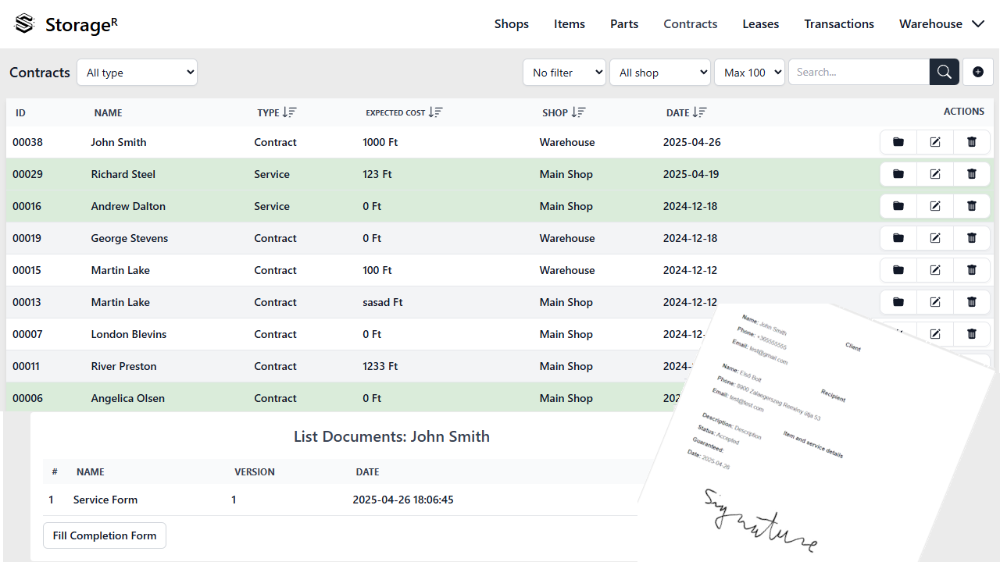

#  StorageR

[](https://github.com/Reterics/storager/actions/workflows/npm-build-test.yml) [](https://codecov.io/github/Reterics/storager) [](https://opensource.org/licenses/MIT) 



Lightweight cloud-based storage and service management application built with React, TypeScript, and TailwindCSS.

## Getting started 🚀

### Preparing the Cloud Environment ☁️

To run StorageR locally, create a .env file based on the provided .env.template.

Create a Google Firebase project in the Firebase console: https://console.firebase.google.com/project/

After you have access to the Firebase dashboard, follow these steps:

- Create a Web App
  - Open **Project settings**
  - Under Your apps section click the **Add app** button and click to the third **Web App** button
  - On the next page Add a nickname to your app and click to **Register app** button and then **Continue to console**
  - Now in the **Your apps** section you can see all of the details you need to put in your **.env** file
- Setup Firebase Rules
  - Firestore: Use the provided firestore.rules in the project root
  - Storage: Use the provided storage.rules in the project root
  - Deploy with Firebase CLI:
    ```bash
    firebase login
    firebase init # choose Firestore and Storage, point to firestore.rules and storage.rules
    firebase deploy --only firestore:rules,storage
    ```
  - For temporary DEV-only testing you can relax rules, but prefer using the provided authenticated rules.

### Environment Setup

1. Install dependencies

```bash
npm install
```

2. Create a .env file from the provided .env.template

```bash
# Windows PowerShell
copy .env.template .env
# macOS/Linux
cp .env.template .env
```

3. Setup environment variables based on your GCP Firebase cloud setup

```dotenv
VITE_FIREBASE_APIKEY=your_api_key
VITE_FIREBASE_AUTH_DOMAIN=your-auth-domain
VITE_FIREBASE_PROJECT_ID=your-project_id
VITE_FIREBASE_STORAGE_BUCKET=your_storage_bucket
VITE_FIREBASE_MESSAGE_SENDER_ID=your-message-sender-id
VITE_FIREBASE_APP_ID=your-firebase-id
VITE_FIREBASE_MEASUREMENT_ID=your-measurement-id

VITE_FIREBASE_DB_SHOPS=shops
VITE_FIREBASE_DB_ITEMS=items
VITE_FIREBASE_DB_PARTS=parts
VITE_FIREBASE_DB_SERVICES=services
VITE_FIREBASE_DB_COMPLETIONS=completions
VITE_FIREBASE_DB_SETTINGS=settings
VITE_FIREBASE_DB_USERS=users
VITE_FIREBASE_DB_ARCHIVE=archive
VITE_FIREBASE_DB_INVOICES=invoices
VITE_FIREBASE_DB_TRANSACTIONS=transactions
VITE_FIREBASE_DB_LEASES=leases
VITE_FIREBASE_DB_LEASE_COMPLETIONS=leaseCompletions

VITE_BASENAME=/
```

4. Start the development server 🔥

```bash
npm run dev
```

Then open http://localhost:5173 in your browser.

5. Build when you are ready

```bash
npm run build
```

- For test build: `npm run build:test`
- For production build: `npm run build:prod`

## Contribute

There are many ways to [contribute](./CONTRIBUTING.md) to StorageR.

- [Submit bugs](https://github.com/Reterics/storager/issues) and help us verify fixes as they are checked in.
- Review the [source code changes](https://github.com/Reterics/storager/pulls).
- [Contribute bug fixes](https://github.com/Reterics/storager/blob/main/CONTRIBUTING.md).

## License

[MIT](./LICENSE) — use freely, modify locally, and share improvements.
